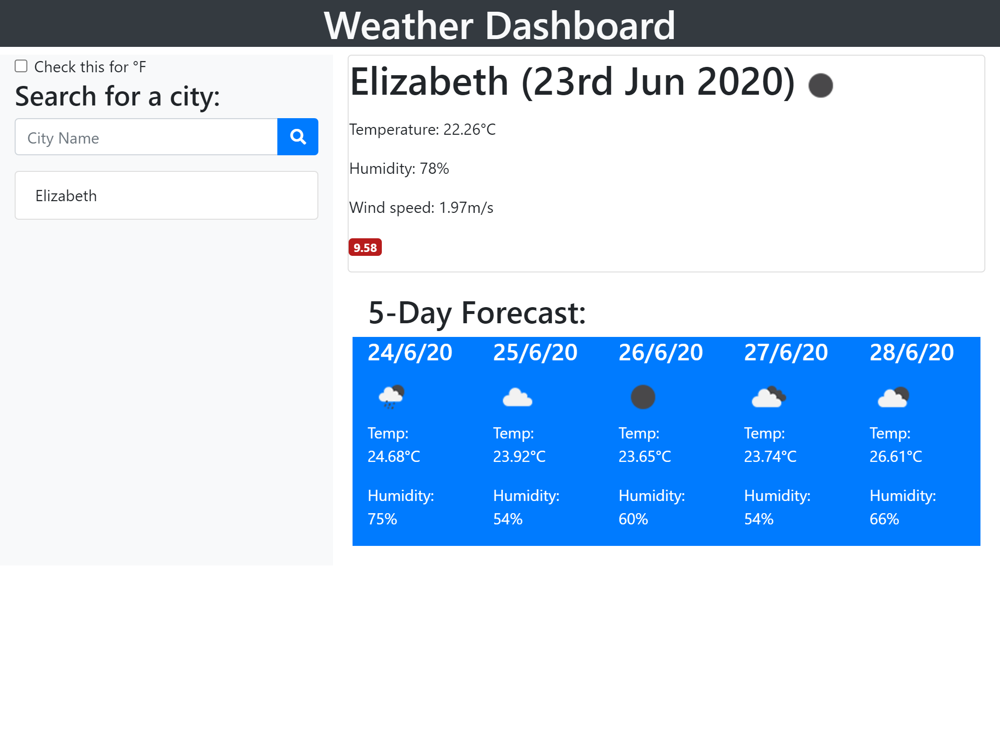
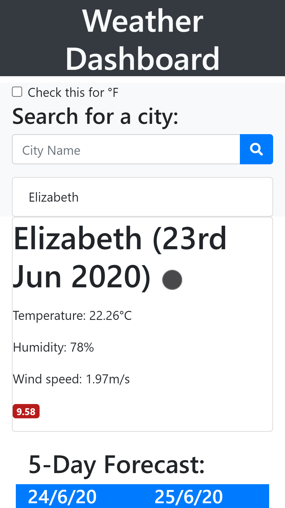

# Weather Dashboard
## [Live site](https://andrew836-dev.github.io/weather-dashboard/)
## What is it?
This is a web app that uses the ajax calls in jQuery to get weather info from openweathermap.org. There is a checkbox to toggle between metric and imperial units, which also changes the date formatting. After a city has been successfully found it is added to the app's search history. Any city name in the history list can be clicked on to get that weather again. The most recently searched city will be at the top of the list, and also saved to localStorage to be automatically searched on page load.

### Technical details
This is the homework for week 6 of the bootcamp.
This page uses :-
* Bootstrap
* jQuery
* Moment.js
* Font Awesome
* openweathermap API

## Screenshot

